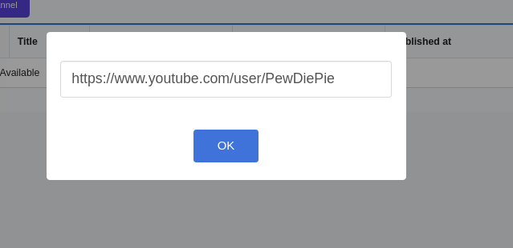
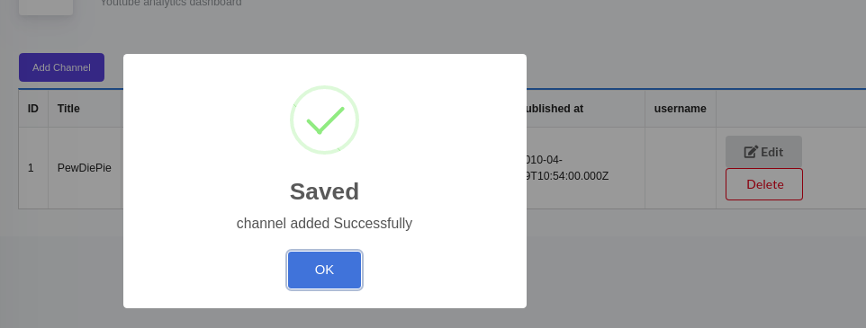
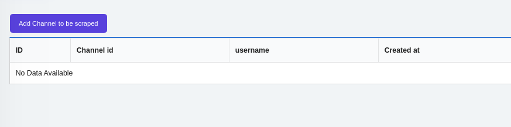
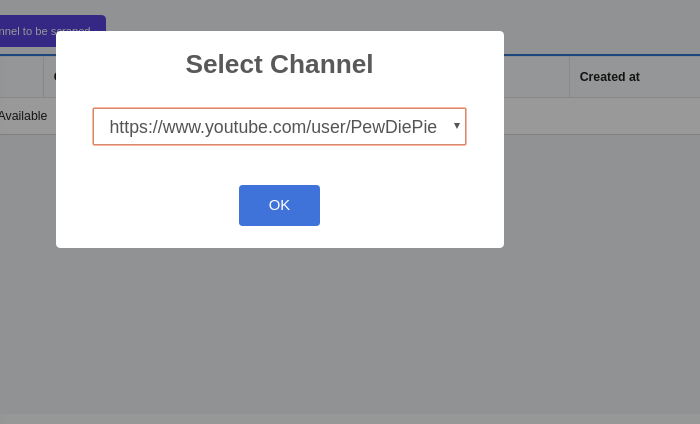
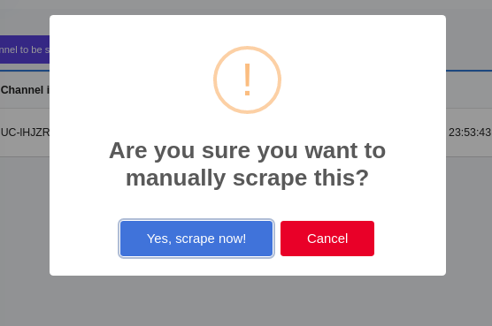
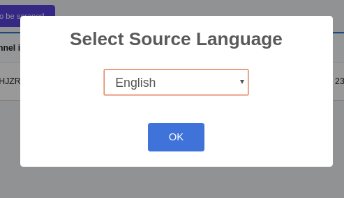
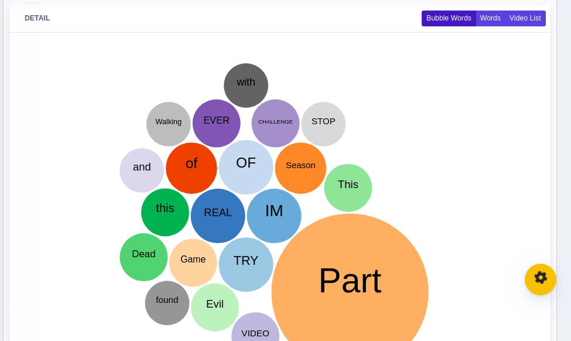

# YOUTUBE TITLE SCRAPER FROM A CHANNEL USING YOUTUBE API AND NODEJS

this repository created for scraping using youtube api and nodejs you can scrape youtube title as much as 500 video beacuse youtube has limitation for how many video we can scrape except you can login with using your api, you can scrape the video you own as much as you can but for the other video from other channel you should ask for permission of the channel owner to scrape

## DEMO

https://pansss.herokuapp.com/

## PREQUISITES

1. install nodejs
2. npm install or yarn install
3. create a yandex translate api and get the api key
4. open .env and add the api key to YOUTUBE_TRANSLATE_API
5. you can start the app by typing node index.js or deploy it to your favorite PaaS like heroku

## bubble words

after scraping the video you can get the top 20 words from the title from the channel you scrape

## how to use

1. first go to /login

2. input default username admin:admin

3. go to channel

4. click add channel
   

5. wait until it success add channel
   

6. go to /admin page
   

7. select channel to be scraped
   

8. click scrape now to scrape for words in title and wait
   

9. select yes
   

10. select source language
    

11. wait until its done
    

12. you can also check terminal if the scraping is done or not by looking for word "No Rows Deleted"
    

13. after its done you can click one of the row and you can see the bubble words the word scraped and how much the value that word used in a channel for pewdiepie the most used word is PART
    
